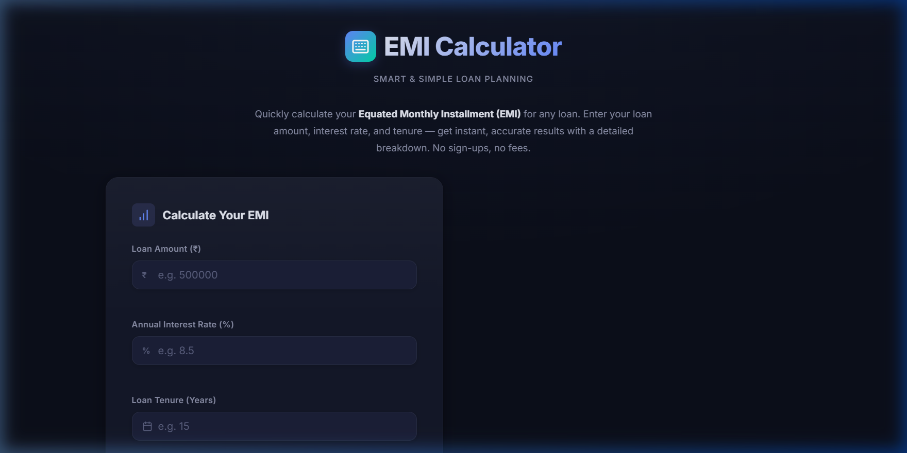
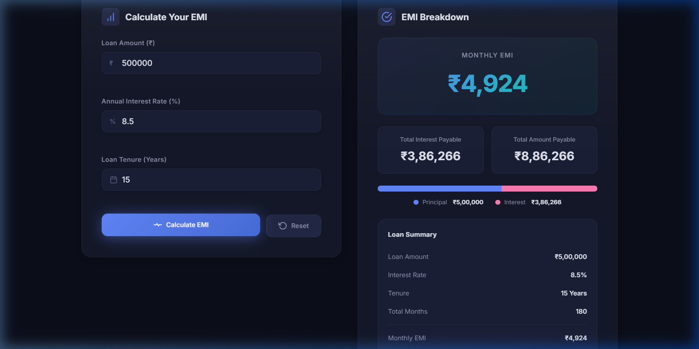
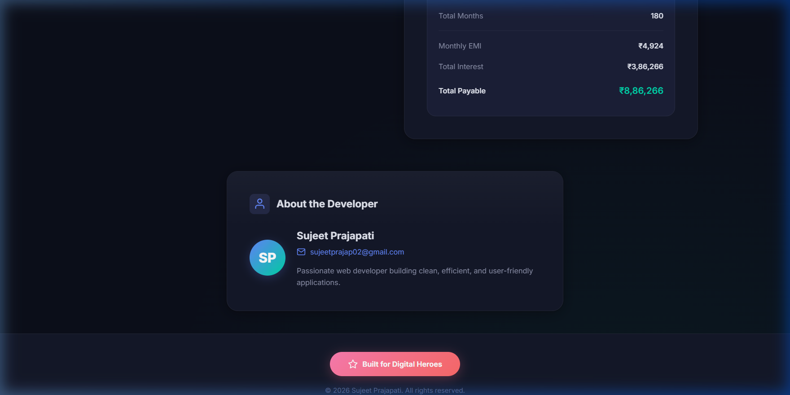
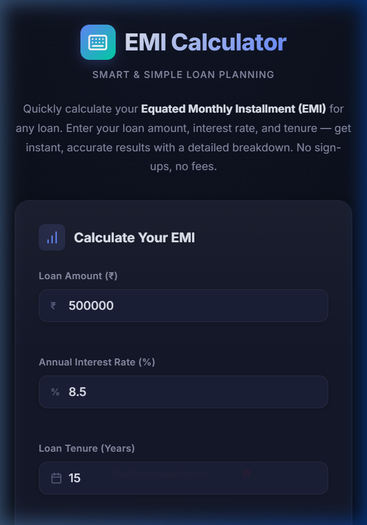

<p align="center">
  
</p>

<h1 align="center">💰 EMI Calculator</h1>

<p align="center">
  <strong>Smart & Simple Loan Planning</strong><br/>
  A modern, production-ready EMI (Equated Monthly Installment) Calculator built with pure HTML, CSS & JavaScript.
</p>

<p align="center">
  
  
  
  
</p>

---

## 📋 Table of Contents

- [About](#-about)
- [Screenshots](#-screenshots)
- [Features](#-features)
- [EMI Formula](#-emi-formula)
- [Tech Stack](#-tech-stack)
- [Project Structure](#-project-structure)
- [Getting Started](#-getting-started)
- [Deployment](#-deployment)
- [Developer](#-developer)
- [License](#-license)

---

## 📖 About

**EMI Calculator** is a free, client-side web application that instantly calculates your Equated Monthly Installment for any loan. Simply enter your loan amount, annual interest rate, and tenure — and get an accurate breakdown of your monthly EMI, total interest payable, and total amount payable.

No sign-ups. No APIs. No backend. Works 100% in the browser.

---

## 📸 Screenshots

### 🖥️ Desktop — Landing Page

The clean, dark-themed landing page with the input form.

<p align="center">
  
</p>

### 📊 Desktop — EMI Results & Breakdown

After calculation — shows monthly EMI, total interest, total payable, a visual principal vs interest bar, and a detailed loan summary card.

<p align="center">
  
</p>

### 👤 About Developer & Footer

About section with developer info, and the "Built for Digital Heroes" button in the footer.

<p align="center">
  
</p>

### 📱 Mobile — Responsive View

Fully responsive layout on mobile devices.

<p align="center">
  
</p>

---

## ✨ Features

| Feature | Description |
|---------|-------------|
| **Instant EMI Calculation** | Uses the standard EMI formula with instant results |
| **Indian Rupee Formatting** | Currency values displayed in ₹ with Indian number grouping (lakh, crore) |
| **Visual Breakdown Bar** | Principal vs Interest ratio visualized with a color-coded bar |
| **Detailed Loan Summary** | Complete summary card with all loan parameters |
| **Form Validation** | Prevents negative values, empty fields, and out-of-range inputs |
| **Meaningful Error Messages** | Context-specific validation messages for each field |
| **Responsive Design** | Mobile-first — looks great on phones, tablets, and desktops |
| **Dark Glassmorphism UI** | Premium dark theme with gradient accents and subtle animations |
| **Smooth Animations** | Fade-in on load, result reveal animation, hover effects |
| **Accessible** | Semantic HTML, ARIA labels, keyboard-navigable, `prefers-reduced-motion` support |
| **No Dependencies** | Zero external libraries — pure HTML, CSS, and JavaScript |
| **Vercel-Ready** | Deploys instantly on Vercel with zero configuration |

---

## 🧮 EMI Formula

The calculator uses the **standard EMI formula**:

```
EMI = [P × R × (1+R)^N] / [(1+R)^N − 1]
```

Where:

| Variable | Description |
|----------|-------------|
| **P** | Principal loan amount |
| **R** | Monthly interest rate = (Annual Rate / 12 / 100) |
| **N** | Total number of monthly installments = (Years × 12) |

### Example Calculation

| Input | Value |
|-------|-------|
| Loan Amount | ₹5,00,000 |
| Interest Rate | 8.5% per annum |
| Tenure | 15 Years |

| Output | Value |
|--------|-------|
| **Monthly EMI** | ₹4,924 |
| **Total Interest Payable** | ₹3,86,266 |
| **Total Amount Payable** | ₹8,86,266 |

---

## 🛠️ Tech Stack

| Technology | Purpose |
|------------|---------|
| **HTML5** | Semantic page structure, accessible form elements |
| **CSS3** | Custom properties, Flexbox, CSS Grid, animations, media queries |
| **Vanilla JavaScript** | EMI calculation, form validation, DOM manipulation |
| **Google Fonts (Inter)** | Modern typography |

> **No frameworks. No build tools. No backend. No paid APIs.**

---

## 📁 Project Structure

```
EMI Digital/
├── index.html          # Main HTML page — all UI sections
├── style.css           # Complete stylesheet — responsive, animated, dark theme
├── script.js           # Application logic — EMI formula, validation, display
├── screenshots/        # Screenshots for documentation
│   ├── 01-landing-page.png
│   ├── 02-emi-results.png
│   ├── 03-about-footer.png
│   └── 04-mobile-view.png
└── README.md           # This file
```

---

## 🚀 Getting Started

### Prerequisites

- A modern web browser (Chrome, Firefox, Safari, Edge)
- That's it! No Node.js, npm, or build tools required.

### Run Locally

1. **Clone the repository**

   ```bash
   git clone https://github.com/YOUR_USERNAME/emi-calculator.git
   cd emi-calculator
   ```

2. **Open in browser**

   Simply open `index.html` in your browser:

   ```bash
   # macOS
   open index.html

   # Windows
   start index.html

   # Linux
   xdg-open index.html
   ```

   Or use a local server (recommended for development):

   ```bash
   # Using Python
   python -m http.server 8000

   # Using Node.js (npx)
   npx serve .
   ```

3. **Start calculating!** Enter your loan details and click **Calculate EMI**.

---

## 🌐 Deployment

### Deploy to Vercel (Free)

1. **Push to GitHub**

   ```bash
   git init
   git add .
   git commit -m "Initial commit: EMI Calculator"
   git remote add origin https://github.com/YOUR_USERNAME/emi-calculator.git
   git branch -M main
   git push -u origin main
   ```

2. **Import to Vercel**

   - Go to [vercel.com](https://vercel.com) → Sign up with GitHub
   - Click **"Add New…"** → **"Project"**
   - Select your `emi-calculator` repo → Click **Import**
   - Set **Framework Preset** to `Other`
   - Leave **Build Command** empty
   - Set **Output Directory** to `./`
   - Click **Deploy** 🚀

3. **Done!** Your app is live at `https://your-project.vercel.app`

> Every push to `main` will trigger an automatic redeployment.

### Alternative Platforms

This project also works on:
- **GitHub Pages** — Enable in repo Settings → Pages → Source: main branch
- **Netlify** — Drag & drop the project folder at [app.netlify.com/drop](https://app.netlify.com/drop)
- **Any static hosting** — No build step required

---

## 👨‍💻 Developer

<table>
  <tr>
    <td align="center" width="200">
      <strong>Sujeet Prajapati</strong><br/>
      <a href="mailto:sujeetprajap02@gmail.com">📧 sujeetprajap02@gmail.com</a><br/><br/>
      <a href="https://digitalheroesco.com" target="_blank">
        
      </a>
    </td>
  </tr>
</table>

---

## 📄 License

© 2026 Sujeet Prajapati. All rights reserved.

---

<p align="center">
  <a href="https://digitalheroesco.com" target="_blank"><strong>⭐ Built for Digital Heroes</strong></a>
</p>
